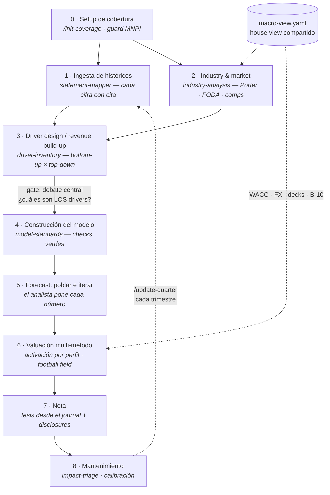

# research_analyst

> Plugin open source de equity research — CFA Society México · AI for Finance.
> Estructura el trabajo de un analista de principio a fin: de "me asignan una
> emisora" a "publico la nota". **v0.1.0** — esqueleto completo; en dogfood.

Cubre emisoras bajo **IFRS, US GAAP y NIF** — SEC y BMV son ciudadanas de primera
clase desde v1, sin distinción de prioridad. Multi-plataforma: **Claude Code**
(plugin nativo), **Cursor** y **Codex** (vía [`AGENTS.md`](AGENTS.md)).

## ¿Qué emisoras puede cubrir hoy?

| Emisora | Funciona hoy | Notas |
|---|---|---|
| **SEC — 10-K/10-Q, US GAAP** | ✅ Sí | Folders, naming, marco y citas normativas (ASC) ya soportados |
| **BMV no financiera — IFRS** | ✅ Sí | Caso base del diseño; marco derivado automáticamente |
| **Privada — NIF** | ✅ Sí | Vía CINIF |
| **FPI / ADR (20-F)** | ✅ Sí | IFRS-IASB sin reconciliación (SEC 33-8879) ya mapeado |
| **FIBRA / REIT** | ✅ Sí | NAV + FFO/AFFO activados por perfil — convención AFFO local aún `[VERIFICAR]` |
| **Comparables cruzados IFRS↔US GAAP↔NIF** | ⚠️ Parcial | Las 7 diferencias norma→línea más comunes están verificadas (leases, inventarios, deterioro, etc.); el resto son `[VERIFICAR]`, nunca inventadas |
| **Bancos / casas de bolsa** | ❌ No — v1 excluye | Requieren mapeo Anexo 33 CUB vs IFRS 9/NIF C-16, sin verificar aún |
| **Aseguradoras** | ❌ No — v1 excluye | Requieren mapeo CNSF vs IFRS 17 |

Ninguna de las exclusiones es un límite de arquitectura: el `issuer-profile.yaml` ya
tiene la ruta (`cnbv_criteria`) y la detecta — simplemente avisa que el contenido
normativo para ese caso no existe todavía. No es release nuevo, es contribución
(ver Áreas de oportunidad más abajo).

## La regla central

El modelo **redacta, estructura, verifica y señala — nunca calcula ni decide.**

- Toda cifra sale de fórmula de Excel o código determinista.
- Todo supuesto lo pone el analista; el plugin lo estructura y lo desafía.
- Toda cita normativa es exacta (ASC 842, NIC 36, NIF B-10…) o se marca
  `[VERIFICAR]` — jamás se inventa.
- El plugin no emite recomendaciones de inversión.

Cuatro etiquetas de trazabilidad en todo artefacto:

| Etiqueta | Qué es |
|---|---|
| `observado` | Cifra de un filing, con cita de fuente y página |
| `guidance` | Afirmación de management — ni verificable ni del analista |
| `supuesto` | Del analista; vive en `assumptions/` |
| `output` | Resultado de fórmula determinista |

## El flujo

Top-down como manda el proceso CFA: macro → industria → compañía. Los drivers se
diseñan **antes** del modelo — el revenue build-up define qué schedules tiene el xlsx.



Entre cada etapa hay un **gate de entrevista y debate adaptativo**: el modelo toma la
posición adversarial argumentando solo con datos observados (nunca inventa cifras),
el analista resuelve, y todo queda en `thesis-journal.md` (append-only). La tesis
nace en industria, no en valuación. Protocolo: [`templates/debate-protocol.md`](templates/debate-protocol.md).

## Instalación

**Claude Code** (plugin nativo):

```bash
claude plugin install research-analyst@<marketplace>   # o clona el repo y: /plugin
```

**Cursor / Codex:** clona el repo en tu workspace — ambos leen `AGENTS.md`
automáticamente, que enruta cada tarea al `SKILL.md` correcto. No hay paso 2.

## Uso

```
/init-coverage AMX ./mis-filings/       # emisora BMV (IFRS) — cobertura completa: etapas 0→6
/init-coverage AAPL ./sec-filings/      # emisora SEC (US GAAP) — mismo flujo, mismo comando
/update-quarter AMX ./nuevo-10q.pdf     # mantenimiento trimestral
/model-check                            # solo auditar checks del modelo
```

Toda skill funciona también suelta, en lenguaje natural:

| Dices… | Corre |
|---|---|
| "archiva este 10-Q de AMX" | `coverage-folders` |
| "¿qué norma gobierna arrendamientos aquí y cambia mi forecast?" | `framework-mapper` |
| "mapea el estado de resultados de este PDF" / "arma el snapshot de este comp" | `statement-mapper` |
| "actualiza el landscape de la industria" | `industry-analysis` |
| "¿qué líneas de mi forecast no tienen driver?" | `driver-inventory` |
| "revisa si mi modelo cumple las convenciones" | `model-standards` |
| "salió este evento relevante, ¿es material?" | `impact-triage` |

## Comandos y skills

3 comandos orquestadores (con **preflight obligatorio** — si algo falla, no corren
parcial) y 7 skills, cada una dueña única de sus artefactos:

| Skill | Artefacto que posee |
|---|---|
| `coverage-folders` | Árbol de carpetas, naming, archivado (nada se borra; retención 7 años) |
| `framework-mapper` | `issuer-profile.yaml` y **toda** cita normativa |
| `statement-mapper` | Cifras capturadas con cita + `comps/*.yaml` |
| `industry-analysis` | `industry-report.md` + universo de comparables |
| `driver-inventory` | `driver-map.md`, assumptions, `forecast-accuracy.md` |
| `model-standards` | El xlsx: estructura, fórmulas, checks, valuación |
| `impact-triage` | Clasificación crítico / relevante / cosmético |

## Perfil de emisora — el marco se deriva, no se pregunta

| Tipo de emisora | Marco | Base |
|---|---|---|
| SEC (10-K/10-Q, sin ADR de terceros) | US GAAP | ASC — FASB |
| BMV no financiera | IFRS (obligatorio desde 2012) | CNBV 056/2008; CUE Art. 78 |
| Banco / financiera | Criterios CNBV (Anexo 33) — **fuera de v1** | Anexo 33 CUB |
| Privada | NIF (CINIF) | — |
| FPI con ADRs | IFRS-IASB, sin reconciliación US GAAP | SEC Release 33-8879 |

El mapa completo de diferencias norma→línea (verificado con investigación
adversarial multi-fuente) vive en
[`skills/framework-mapper/references/ifrs-asc-nif-line-map.md`](skills/framework-mapper/references/ifrs-asc-nif-line-map.md)
— incluye el monitor de inflación **NIF B-10** (umbral 26% trienal) con escenario de
reconexión obligatorio para emisoras NIF.

## Valuación — menú completo, activación por perfil

Todo por fórmula determinista; el football field agrega solo métodos activos.

- **Core (siempre):** DCF FCFF multi-stage con **terminal dual** (Gordon + exit
  multiple, cruzados) · Comps con media armónica desde snapshots con timestamp ·
  Sensibilidades.
- **Condicionales:** DDM (Gordon/two-stage/H-model), FCFE, NAV + FFO/AFFO
  (FIBRAs), SOTP (conglomerados).
- **Especificado, inactivo hasta v2:** Residual income + justified P/B (bancos).
- Check de convergencia: DDM/FCFE/RI divergentes = supuesto inconsistente — se
  reporta, nunca se promedia.

## Estructura del repo

```
research_analyst/
├── AGENTS.md                 # adapter Cursor + Codex (router → skills)
├── .claude-plugin/plugin.json
├── commands/                 # init-coverage · update-quarter · model-check
├── skills/                   # fuente única de verdad (7 skills + references)
├── templates/                # issuer-profile · macro-view · comp-snapshot ·
│                             #   model-spec · coverage-tree · debate-protocol
└── docs/architecture.md      # diseño completo y el porqué de cada decisión
```

## Áreas de oportunidad — te invitamos a colaborar

Fronteras conocidas; cada una es un PR bienvenido:

1. **Bancos (Anexo 33 CUB):** mapeo línea por línea vs IFRS 9 / NIF C-16 →
   desbloquea financieras y activa RI.
2. **Aseguradoras:** criterios CNSF vs IFRS 17.
3. **Citas NIF pendientes:** verificación primaria de D-1, D-4, B-2, B-3, C-4,
   C-15, D-5, C-8 (hoy `[VERIFICAR]`).
4. **Conector de datos:** MCP/API que llene `comp-snapshot.yaml` y
   `macro-view.yaml` — mismo formato, otra fuente.
5. **Macro generador:** borrador de macro view desde fuentes públicas oficiales.
6. **IFRS 18 (2027):** impacto en presentación del estado de resultados.
7. **Convención AFFO de FIBRAs** documentada con fuente.
8. **Suite de evals:** casos golden por skill.
9. **Adapters nativos** Cursor/Codex cuando soporten skills.

**Formato de un buen PR de regulación:** norma exacta + fuente primaria + línea del
modelo que toca + ajuste que exige al analista. Reglas de la casa: toda cita
verificada o `[VERIFICAR]`; cero datos de clientes; cero material propietario.

## Licencia y disclaimer

MIT. Proyecto educativo y de productividad para analistas; no constituye asesoría
de inversión. El analista es responsable de todo supuesto, cifra publicada y
recomendación.
