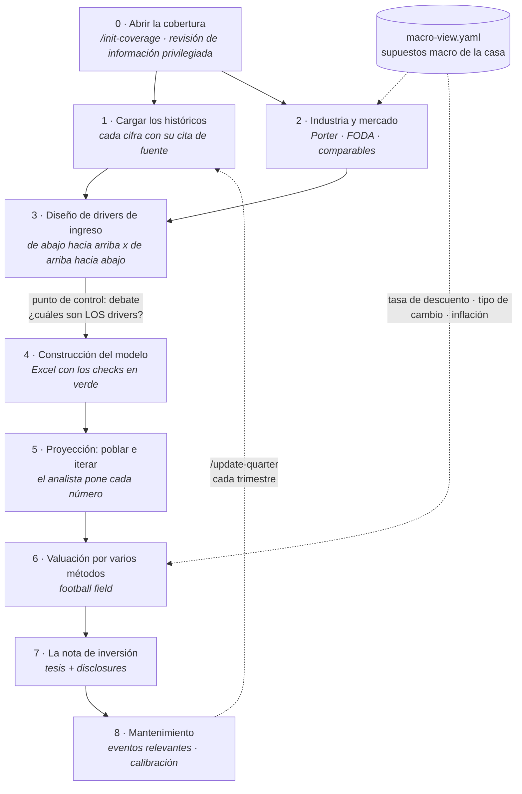

# research_analyst

> Un asistente de investigación bursátil que acompaña a un analista financiero
> desde "me asignaron cubrir esta empresa" hasta "publiqué mi reporte".
> Proyecto open source de **CFA Society México · AI for Finance**.
> **v0.1.0** — estructura completa, en pruebas de uso real (*dogfood*).

---

## En una frase

Un analista de acciones (*equity research*) pasa semanas leyendo reportes
financieros, armando un modelo en Excel y escribiendo una nota de inversión.
Este proyecto le da un copiloto que **organiza, redacta, verifica y cuestiona**
ese trabajo — pero **nunca calcula ni decide por él**.

## ¿Para quién es?

- **Analistas de acciones** (buy-side o sell-side) que cubren empresas mexicanas
  o estadounidenses y quieren un proceso repetible en lugar de empezar de cero
  con cada empresa.
- **Estudiantes y candidatos CFA** que quieren ver el proceso completo, ordenado
  como lo enseña el CFA Institute: primero la macro, luego la industria, luego la
  empresa.
- **Equipos pequeños** que necesitan que todos sus modelos se vean igual, usen
  los mismos supuestos de casa y se puedan auditar.

## ¿Qué problema resuelve?

| Dolor típico del analista | Qué hace el plugin |
|---|---|
| Cada modelo de Excel es distinto y nadie recuerda de dónde salió un número | Cada cifra queda etiquetada con su fuente y la página del reporte original |
| Los supuestos viven en la cabeza del analista | Los supuestos se escriben, se guardan y se cuestionan con datos |
| Las carpetas y los nombres de archivo son un caos | Estructura de carpetas y nombres fijos, con retención de 7 años |
| "¿Qué norma contable aplica aquí?" | El plugin identifica el marco contable y cita la norma exacta, o la marca como pendiente de verificar |
| El reporte trimestral se rehace desde cero | Un comando actualiza el modelo con el nuevo trimestre |

---

## La regla que no se rompe

> **El modelo redacta, estructura, verifica y señala. Nunca calcula ni decide.**

En concreto:

- **Toda cifra** sale de una fórmula de Excel o de código verificable — no de la
  intuición del modelo de IA.
- **Todo supuesto** lo pone el analista. El plugin lo organiza y lo pone a prueba.
- **Toda cita normativa** es exacta (ASC 842, NIC 36, NIF B-10…) o se marca
  `[VERIFICAR]`. Nunca se inventa una norma.
- **El plugin no emite recomendaciones de inversión.** Eso es responsabilidad y
  firma del analista.

### Cómo se etiqueta cada dato

Todo número o afirmación lleva una de cuatro etiquetas, para que cualquiera pueda
rastrear de dónde salió:

| Etiqueta | Significa |
|---|---|
| `observado` | Viene de un reporte oficial de la empresa, con fuente y página |
| `guidance` | Lo dijo la dirección de la empresa — ni verificable ni del analista |
| `supuesto` | Lo puso el analista, y vive en `driver-map.md` y la tab Assumptions del modelo |
| `output` | Es el resultado de una fórmula |

---

## Cómo se ve el proceso

El orden es el del proceso CFA: **macro → industria → empresa**. Un detalle clave:
los *drivers* (las variables que mueven los ingresos, como precio × volumen) se
definen **antes** de construir el Excel. Así el modelo se arma alrededor del
negocio, y no al revés.



### Los puntos de control (*gates*)

Entre una etapa y la siguiente hay una entrevista y un debate. El modelo toma la
postura contraria a propósito — argumentando **solo con datos observados**, nunca
con cifras inventadas — y el analista responde. Todo queda escrito en un diario
de tesis (`thesis-journal.md`) al que solo se agrega, nunca se borra.

La idea de fondo: **la tesis de inversión nace en el análisis de industria, no en
la hoja de valuación.**

Protocolo completo: [`templates/debate-protocol.md`](templates/debate-protocol.md).

---

## ¿Qué empresas puede cubrir hoy?

Funciona con empresas que reportan bajo cualquiera de los tres marcos contables
relevantes para México y Estados Unidos: **IFRS**, **US GAAP** y **NIF**. La bolsa
mexicana (BMV) y el mercado estadounidense (SEC) tienen el mismo nivel de soporte
— ninguno es "el caso secundario".

| Tipo de empresa | ¿Funciona hoy? | Notas |
|---|---|---|
| **Estadounidense en la SEC** (10-K / 10-Q, US GAAP) | ✅ Sí | Carpetas, nombres, marco contable y citas normativas (ASC) ya soportados |
| **Mexicana en la BMV, no financiera** (IFRS) | ✅ Sí | Es el caso base del diseño |
| **Empresa privada** (NIF) | ✅ Sí | Vía CINIF |
| **Extranjera con ADR** (formato 20-F) | ✅ Sí | IFRS sin reconciliación, según la regla SEC 33-8879 |
| **FIBRA / REIT** (fideicomisos inmobiliarios) | ✅ Sí | Las métricas NAV y FFO/AFFO se activan solas — la convención local de AFFO sigue marcada `[VERIFICAR]` |
| **Comparar empresas entre marcos** (IFRS ↔ US GAAP ↔ NIF) | ⚠️ Parcial | Las 7 diferencias más comunes están verificadas (arrendamientos, inventarios, deterioro…); el resto se marca `[VERIFICAR]`, nunca se inventa |
| **Bancos y casas de bolsa** | ❌ No en v1 | Falta el mapeo del Anexo 33 de la CNBV contra IFRS 9 / NIF C-16 |
| **Aseguradoras** | ❌ No en v1 | Falta el mapeo de criterios CNSF contra IFRS 17 |

**Importante:** lo que falta no es un límite de diseño. El plugin ya detecta que se
trata de un banco o de una aseguradora y te avisa que el contenido normativo aún
no existe. Completarlo no requiere una nueva versión del producto — requiere una
contribución (ver [Áreas de oportunidad](#áreas-de-oportunidad--te-invitamos-a-colaborar)).

---

## Instalación

**Claude Code** (plugin nativo). El repositorio ya es un *marketplace* de plugins
(`.claude-plugin/marketplace.json`), así que basta agregarlo e instalar:

```
/plugin marketplace add alanvaa06/research_analyst
/plugin install research-analyst@research-analyst
```

O desde la terminal:

```bash
claude plugin install research-analyst@research-analyst
```

**Claude Cowork** (app de escritorio). Cowork lee el mismo formato de
marketplace, sin pasos extra:

1. Abre Cowork → menú **Customize** → **Add marketplace**.
2. Escribe `alanvaa06/research_analyst`.
3. Busca **research-analyst** en el catálogo y haz clic en **Install**
   (elige alcance personal u organización).

Comandos, *skills* y hooks funcionan igual en Cowork que en Claude Code.

**Codex** (CLI / app de escritorio). El repositorio incluye
`.codex-plugin/plugin.json`, y Codex también lee el marketplace en formato
`.claude-plugin/` por compatibilidad:

```bash
codex plugin marketplace add alanvaa06/research_analyst
```

Luego instala **research-analyst** desde el navegador de plugins (`/plugins`).
Nota: Codex no soporta comandos slash de plugins — usa las *skills* pidiéndolo
en lenguaje natural (o clona el repo: Codex lee [`AGENTS.md`](AGENTS.md)).

**Cursor:** clona el repositorio dentro de tu espacio de trabajo. Lee
[`AGENTS.md`](AGENTS.md) automáticamente, que enruta cada tarea a la
habilidad (*skill*) correcta. No hay paso 2.

## Uso

Tres comandos cubren el ciclo completo:

```
/init-coverage AMX ./mis-filings/       # abrir cobertura de una empresa de la BMV (IFRS)
/init-coverage AAPL ./sec-filings/      # lo mismo para una empresa de la SEC (US GAAP)
/update-quarter AMX ./nuevo-10q.pdf     # actualizar con el trimestre nuevo
/model-check                            # solo auditar los checks del Excel
```

Pero no hace falta memorizar comandos: también funciona pidiéndolo en español
normal.

| Si escribes… | Se ejecuta |
|---|---|
| "archiva este 10-Q de AMX" | `coverage-folders` |
| "¿qué norma gobierna arrendamientos aquí y cambia mi proyección?" | `framework-mapper` |
| "mapea el estado de resultados de este PDF" | `statement-mapper` |
| "actualiza el panorama de la industria" | `industry-analysis` |
| "¿qué líneas de mi proyección no tienen driver?" | `driver-inventory` |
| "revisa si mi modelo cumple las convenciones" | `model-standards` |
| "salió este evento, ¿es material?" | `impact-triage` |

## Qué hay adentro

**3 comandos orquestadores** — antes de correr revisan que todo esté en orden; si
algo falla, no dejan el trabajo a medias.

**7 habilidades (*skills*)**, cada una dueña única de un entregable. Nadie pisa el
trabajo de nadie:

| Habilidad | De qué es dueña |
|---|---|
| `coverage-folders` | Carpetas, nombres de archivo, archivado (nada se borra; retención de 7 años) |
| `framework-mapper` | El perfil de la empresa y **todas** las citas normativas |
| `statement-mapper` | Las cifras capturadas de los reportes, con su cita |
| `industry-analysis` | El reporte de industria y el universo de comparables |
| `driver-inventory` | El mapa de drivers, los supuestos y el histórico de aciertos |
| `model-standards` | El archivo de Excel: estructura, fórmulas, checks, valuación |
| `impact-triage` | Clasificar noticias: crítico / relevante / cosmético |

---

## Detalle técnico

<details>
<summary><b>Cómo se decide el marco contable</b> — el plugin lo deduce, no te lo pregunta</summary>

<br/>

| Tipo de empresa | Marco contable | Fundamento |
|---|---|---|
| SEC (10-K/10-Q, sin ADR de terceros) | US GAAP | ASC — FASB |
| BMV no financiera | IFRS (obligatorio desde 2012) | CNBV 056/2008; CUE Art. 78 |
| Banco o financiera | Criterios CNBV (Anexo 33) — **fuera de v1** | Anexo 33 CUB |
| Empresa privada | NIF (CINIF) | — |
| Extranjera con ADR | IFRS-IASB, sin reconciliación a US GAAP | SEC Release 33-8879 |

El mapa completo de diferencias norma → línea del estado financiero (verificado con
investigación adversarial de múltiples fuentes) está en
[`skills/framework-mapper/references/ifrs-asc-nif-line-map.md`](skills/framework-mapper/references/ifrs-asc-nif-line-map.md).
Incluye el monitor de inflación **NIF B-10** (umbral de 26% acumulado en tres años),
con el escenario de reconexión obligatorio para empresas que reportan bajo NIF.

</details>

<details>
<summary><b>Métodos de valuación disponibles</b></summary>

<br/>

Todo se calcula por fórmula. El *football field* — la gráfica que compara el rango
de valor que arroja cada método — solo incluye los métodos que aplican a esa
empresa.

- **Siempre activos:** DCF de flujo libre a la firma (FCFF) en varias etapas, con
  **valor terminal dual** (Gordon y múltiplo de salida, cruzados entre sí) ·
  comparables con media armónica, tomados de fotos con fecha y hora ·
  sensibilidades.
- **Se activan según la empresa:** DDM (Gordon, dos etapas, H-model), FCFE,
  NAV + FFO/AFFO para FIBRAs, suma de partes (SOTP) para conglomerados.
- **Especificados pero inactivos hasta v2:** ingreso residual y P/B justificado
  (bancos).
- **Check de convergencia:** si DDM, FCFE e ingreso residual dan resultados muy
  distintos, es señal de un supuesto inconsistente. Se reporta — nunca se promedia
  para esconderlo.

</details>

<details>
<summary><b>Estructura del repositorio</b></summary>

<br/>

```
research_analyst/
├── AGENTS.md                 # adaptador para Cursor y Codex (enruta a las skills)
├── .claude-plugin/plugin.json
├── commands/                 # init-coverage · update-quarter · model-check
├── skills/                   # fuente única de verdad (7 skills + referencias)
├── templates/                # perfil de emisora · macro view · comparables ·
│                             #   especificación del modelo · árbol de carpetas ·
│                             #   protocolo de debate
└── docs/architecture.md      # el diseño completo y el porqué de cada decisión
```

</details>

---

## Glosario rápido

Por si vienes de fuera de finanzas — o de fuera de tecnología:

| Término | Qué significa aquí |
|---|---|
| **Emisora** | Empresa que cotiza en bolsa y, por lo tanto, publica reportes obligatorios |
| **Filing** | Reporte oficial que una empresa entrega al regulador (10-K anual, 10-Q trimestral) |
| **BMV / SEC** | Bolsa Mexicana de Valores / regulador bursátil de Estados Unidos |
| **IFRS / US GAAP / NIF** | Los tres conjuntos de reglas contables: internacional, estadounidense, mexicano |
| **Driver** | La variable que mueve un número: los ingresos son precio × volumen, no una cifra suelta |
| **DCF** | Valuar una empresa trayendo a valor de hoy el efectivo que generará en el futuro |
| **Comparables (*comps*)** | Valuar comparando múltiplos contra empresas parecidas |
| **Football field** | Gráfica de barras que muestra el rango de valor que arroja cada método |
| **MNPI** | Información privilegiada no pública; el plugin revisa que no entre al proceso |
| **Skill** | Un módulo de instrucciones que el asistente carga solo cuando aplica a la tarea |
| **Dogfood** | Usar tu propio producto en trabajo real antes de recomendárselo a otros |

---

## Áreas de oportunidad — te invitamos a colaborar

Estas son las fronteras conocidas del proyecto. Cada una es un *pull request*
bienvenido:

1. **Bancos (Anexo 33 CUB):** mapeo línea por línea contra IFRS 9 / NIF C-16 —
   desbloquea financieras y activa el método de ingreso residual.
2. **Aseguradoras:** criterios CNSF contra IFRS 17.
3. **Citas NIF pendientes:** verificación con fuente primaria de D-1, D-4, B-2,
   B-3, C-4, C-15, D-5 y C-8 (hoy marcadas `[VERIFICAR]`).
4. **Conector de datos:** una integración que llene automáticamente los archivos de
   comparables y de macro view — mismo formato, otra fuente.
5. **Generador de macro:** un borrador de house view a partir de fuentes públicas
   oficiales.
6. **IFRS 18 (entra en 2027):** su impacto en la presentación del estado de
   resultados.
7. **Convención de AFFO para FIBRAs**, documentada con fuente.
8. **Suite de pruebas:** casos de referencia por cada skill.
9. **Adaptadores nativos** para Cursor y Codex, cuando esas herramientas soporten
   skills.

**Cómo se ve un buen PR de contenido normativo:** la norma exacta + la fuente
primaria + la línea del modelo que toca + el ajuste que le exige al analista.

**Reglas de la casa:** toda cita va verificada o marcada `[VERIFICAR]`; cero datos
de clientes; cero material propietario.

## Licencia y aviso legal

MIT. Proyecto educativo y de productividad para analistas. **No constituye asesoría
de inversión.** El analista es responsable de todo supuesto, de toda cifra
publicada y de toda recomendación que emita.
